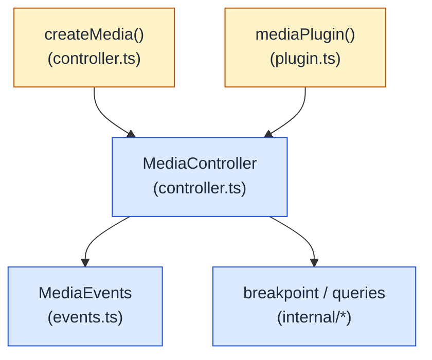

# @ailuracode/alpine-media

Framework-agnostic reactive viewport, breakpoint, and media-feature manager for Alpine.js, Blade, Livewire, and any TypeScript front end. Exposes the viewport snapshot (`width` / `height` / `breakpoint`) plus browser media features (`prefersReducedMotion`, `prefersContrast`, `prefersColorScheme`, `hover`, `pointer`, `orientation`) and touch / pointer capabilities through a single `$store.media` store and `$media` magic.

## Architecture



The core is engine-free: no Alpine import, no DOM mutation outside the matchMedia / `resize` listeners the controller owns. The Alpine integration is a thin adapter that exposes the manager through `$store.media` and `$media`. The `MediaController` extends `BaseController` from `@ailuracode/alpine-core`, so consumers get `id` / `phase` / `isDestroyed` / `mount()` / `destroy()` for free.

## State model

Two complementary slices:

| Slice                       | Members                                                                                |
| --------------------------- | -------------------------------------------------------------------------------------- |
| **Viewport**                | `width`, `height`, `breakpoint`, `intervals`                                            |
| **Derived viewport**        | `isMobile`, `isTablet`, `isDesktop`, `is(name)`                                        |
| **Media features**          | `prefersReducedMotion`, `prefersContrast`, `prefersColorScheme`, `hover`, `pointer`, `orientation` |
| **Touch / pointer**         | `maxTouchPoints`, `isTouch`, `isCoarse`, `isFine`, `canHover`                          |

`breakpoint` is resolved from the live `matchMedia` queries (one `(max-width: Xpx)` per interval except the trailing "infinite" fallback) — the browser's own breakpoint signal, not a re-derivation from `window.innerWidth`. This keeps the value consistent across zoom and DPR rounding.

## Install

```bash
pnpm add @ailuracode/alpine-media @ailuracode/alpine-core alpinejs
```

## Standalone usage (no Alpine)

```ts
import { createMedia } from "@ailuracode/alpine-media";

const media = createMedia({
  intervals: [
    { name: "mobile", maxWidth: 767 },
    { name: "tablet", maxWidth: 1024 },
    { name: "desktop", maxWidth: Number.POSITIVE_INFINITY },
  ],
});

media.on("change", (detail) => {
  // detail: { current, previous, source: 'initialization' | 'viewport' | 'user' }
  console.log(detail.current.breakpoint, detail.source);
});
```

`createMedia()` is synchronous and returns a fully-mounted controller. The `initialization` event fires on a microtask so consumers can subscribe right after the call.

## Alpine usage

```ts
import Alpine from "alpinejs";
import { mediaPlugin } from "@ailuracode/alpine-media";

Alpine.plugin(
  mediaPlugin({
    intervals: [
      { name: "mobile", maxWidth: 767 },
      { name: "tablet", maxWidth: 1024 },
      { name: "desktop", maxWidth: Number.POSITIVE_INFINITY },
    ] as const,
  })
);
Alpine.start();
```

```html
<span x-show="$store.media.isMobile">Mobile nav</span>
<span x-show="$store.media.isDesktop">Desktop nav</span>

<p>Width: <span x-text="$store.media.width"></span>px</p>
<p>Breakpoint: <span x-text="$store.media.breakpoint"></span></p>
<p x-show="$store.media.prefersReducedMotion">Reduced motion preferred</p>
```

The plugin registers `$store.media` and `$media` (both backed by the same controller). Every method forwards to the controller, and `Alpine.cleanup` destroys it when the runtime tears down.

## Default intervals

| Name     | Range          |
| -------- | -------------- |
| `mobile` | ≤ 767 px       |
| `desktop` | ≥ 768 px      |

Override with `intervals: [...] as const` for full literal type inference of `breakpoint`.

## Custom intervals

You can define arbitrary interval names and breakpoints. Intervals are checked **smallest-first** — the first `(max-width: Xpx)` query that matches wins.

```ts
mediaPlugin({
  intervals: [
    { name: "phone", maxWidth: 480 },
    { name: "tablet", maxWidth: 768 },
    { name: "desktop", maxWidth: Number.POSITIVE_INFINITY },
  ] as const,
});
```

## TypeScript

```ts
import { createMedia, type MediaChangeDetail } from "@ailuracode/alpine-media";

const media = createMedia({
  intervals: [
    { name: "mobile", maxWidth: 767 },
    { name: "desktop", maxWidth: Number.POSITIVE_INFINITY },
  ] as const,
});

media.snapshot().breakpoint; // "mobile" | "desktop"

media.on("change", (detail: MediaChangeDetail<"mobile" | "desktop">) => {
  console.log(detail.current.breakpoint);
});
```

Add `/// <reference path="node_modules/@ailuracode/alpine-media/dist/global.d.ts" />` for `$store.media` / `$media` types in templates.

## API reference

```ts
const media = createMedia({
  intervals?: readonly MediaInterval[],     // default: DEFAULT_MEDIA_INTERVALS
  id?: string,                              // default: auto-generated ("media-<n>")
  debounceMs?: number,                      // default: 100
});

// Viewport reads
media.width                 // number
media.height                // number
media.breakpoint            // Name (literal union)
media.intervals             // readonly MediaInterval<Name>[]
media.snapshot()            // { width, height, breakpoint }

// Media features
media.prefersReducedMotion  // boolean
media.prefersContrast       // 'no-preference' | 'more' | 'less' | 'custom'
media.prefersColorScheme    // 'light' | 'dark'
media.hover                 // 'none' | 'hover'
media.pointer               // 'none' | 'coarse' | 'fine'
media.orientation           // 'portrait' | 'landscape'
media.maxTouchPoints        // number
media.isTouch               // boolean
media.isCoarse              // boolean
media.isFine                // boolean
media.canHover              // boolean

// Commands
media.refresh()             // refresh every observable; returns true on change
media.refreshWidth()        // width only; returns true on change
media.refreshHeight()       // height only; returns true on change

// Events
media.on("change", listener) // listener({ current, previous, source })
                            //   source: 'initialization' | 'viewport' | 'user'

// Lifecycle
media.id                    // string (auto-generated)
media.isDestroyed           // boolean
media.destroy()             // idempotent — releases every listener
```

```ts
Alpine.plugin(mediaPlugin({ intervals?, id?, debounceMs? }));
```

## Cleanup

`media.destroy()` is idempotent and tears down:

- every `matchMedia` listener (per breakpoint and per feature)
- the debounced `resize` listener
- every subscriber

Call it when the consumer unmounts (e.g. inside a SPA route teardown, an Alpine `x-destroy` hook, or a Blade `@yield` block that lives for one request). For server-rendered pages that load Alpine on every navigation, the listeners are torn down automatically with the `window`.

## SSR

The package is fully importable in a Node runtime. The controller seeds itself with `SSR_MEDIA_DEFAULTS` when `window` is undefined:

- `width` / `height` default to `0`
- media features use conservative defaults (`prefersColorScheme: 'light'`, `pointer: 'fine'`, ...)
- `matchMedia` / `resize` listeners are not registered under SSR

`resolveMediaBreakpoint(width, intervals)` is exported as a pure helper so consumers can build SSR snapshots without booting the controller.

## Exported helpers

```ts
import {
  DEFAULT_MEDIA_INTERVALS,
  DEFAULT_MEDIA_DEBOUNCE_MS,
  SSR_MEDIA_DEFAULTS,
  mediaIntervals,
  resolveMediaBreakpoint,
  createMedia,
  createMediaStore,
  MediaController,
  mediaPlugin,
} from "@ailuracode/alpine-media";
```

| Helper                      | Description                                                              |
| --------------------------- | ------------------------------------------------------------------------ |
| `mediaIntervals(arr)`       | Asserts literal types (`as const`) on an intervals array                 |
| `resolveMediaBreakpoint`    | Pure: resolves which interval a width belongs to                         |
| `DEFAULT_MEDIA_INTERVALS`   | Default `mobile` / `desktop` breakpoints                                  |
| `DEFAULT_MEDIA_DEBOUNCE_MS` | Default resize debounce window (100 ms)                                   |
| `SSR_MEDIA_DEFAULTS`        | Safe defaults when `window` is unavailable                               |
| `createMedia(options)`      | Factory: builds + mounts a `MediaController`                             |
| `createMediaStore(ctrl)`    | Builds a `MediaStore` reactive mirror from a controller                  |
| `MediaController`           | Headless controller class (extends `BaseController` from core)           |
| `mediaPlugin(options)`      | Alpine plugin factory — wires the controller into `$store.media` / `$media` |

## Performance

- Breakpoint and media features update via `matchMedia` `change` events (with `addListener` fallback for legacy runtimes).
- Width and height update on `resize`, debounced (default 100 ms, configurable via `debounceMs`).

## Migration from `@ailuracode/alpine-media@0.1.x`

`0.2.0` is a breaking rewrite aligned to `@ailuracode/alpine-theme@0.2.x` and `@ailuracode/alpine-toggle@0.3.x`. The package now exposes a controller-based architecture and named exports.

| `0.1.x`                                                                                  | `0.2.x`                                                                                                              |
| ---------------------------------------------------------------------------------------- | -------------------------------------------------------------------------------------------------------------------- |
| `import media from "@ailuracode/alpine-media"` (default export)                            | `import { mediaPlugin } from "@ailuracode/alpine-media"` (named export, matches `themePlugin` / `togglePlugin`)    |
| `Alpine.plugin(media({ ... }))`                                                           | `Alpine.plugin(mediaPlugin({ ... }))`                                                                                |
| Single `src/index.ts` (492 lines)                                                         | Split into `controller.ts` / `plugin.ts` / `types.ts` / `events.ts` / `internal/*` (matches the rest of the toolkit) |
| Reactive store built inline with no controller abstraction                                | `MediaController` extends `BaseController` from `@ailuracode/alpine-core` — typed `on('change', listener)` event bus |
| No `change` event                                                                        | Single `change` event with `{ current, previous, source: 'initialization' \| 'viewport' \| 'user' }` detail payload |
| `global.d.ts` augmented `Alpine.Stores` and `Alpine.Magics<T>`                            | `global.d.ts` re-exports public types only (matches core's stance) — consumers declare their own augmentations      |
| Direct mutation of `width` / `breakpoint` via `Alpine.reactive` proxy                    | Store holds mutable mirror fields; the controller's `change` subscription reassigns them so reactivity tracks       |
| `@ailuracode/alpine-core` was a `dependency`                                              | `@ailuracode/alpine-core` is now a `peerDependency`                                                                  |
| Manual SSR guards scattered through the source                                            | Centralized `SSR_MEDIA_DEFAULTS` constant + `safeWindow` from core                                                  |
| Built with `tsc` + inline `node -e`                                                       | Built with `tsup` (matches theme / toggle)                                                                            |

The public method surface on `$store.media` is unchanged — `refresh()`, `refreshWidth()`, `refreshHeight()`, `is()`, and every observable field (`width`, `height`, `breakpoint`, `isMobile`, `prefersReducedMotion`, etc.) work exactly as before. The only observable behavior change is the addition of the `change` event bus and the typed `id` / `isDestroyed` accessors.

## License

MIT