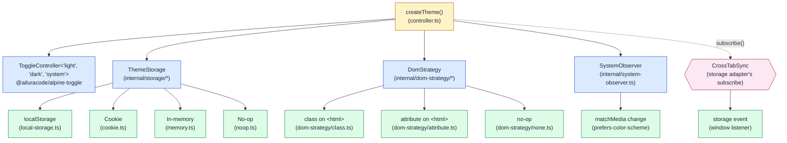

# @ailuracode/alpine-theme

Framework-agnostic theme manager for Alpine.js, Blade, Livewire, and any TypeScript front end. Light, dark, and `system` modes; pluggable persistence; class or `data-theme` DOM strategies; cross-tab sync; SSR-safe; head snippet for flash prevention.

## Architecture



The core is engine-free: no Alpine import, no DOM mutation outside the strategy, no `window`/`document` access at import time. The Alpine integration is a thin adapter that exposes the manager through `$store.theme` and `$theme`.

The three-value `current` state machine (`light` / `dark` / `system`) is composed from a [`ToggleController`](https://github.com/ailuracode/alpinejs-toolkit/tree/main/packages/toggle) — the same toolkit primitive that powers the `$toggle` magic. Theme delegates validation and transitions to the inner toggle, and layers persistence, DOM application, system observation, and cross-tab synchronization on top. Hydration from storage uses `toggle.setSilently(...)` so the queued initialization microtask preserves the persisted value instead of resetting to the configured default.

## State model

Three orthogonal values:

| Field      | Meaning                                 | Values                          |
| ---------- | --------------------------------------- | ------------------------------- |
| `current`  | The user selection                      | `'light' \| 'dark' \| 'system'` |
| `system`   | The OS preference                       | `'light' \| 'dark'`             |
| `resolved` | The effective theme applied to the page | `'light' \| 'dark'`             |

Examples:

- User picked `system`, OS is dark → `current='system'`, `system='dark'`, `resolved='dark'`.
- User picked `light`, OS is dark → `current='light'`, `system='dark'`, `resolved='light'`.
- User picked `dark`, OS is light → `current='dark'`, `system='light'`, `resolved='dark'`.

`resolved` updates automatically when the OS flips **only** when `current === 'system'`. An explicit user choice freezes `resolved` against OS changes.

## Install

```bash
pnpm add @ailuracode/alpine-theme @ailuracode/alpine-toggle @ailuracode/alpine-core alpinejs
```

## Standalone usage (no Alpine)

```ts
import { createTheme, createLocalStorageThemeStorage } from '@ailuracode/alpine-theme';

const theme = createTheme({
    defaultTheme: 'system',
    storage: createLocalStorageThemeStorage({ key: 'app-theme' }),
    strategy: 'class',
    darkClass: 'dark',
    lightClass: 'light',
    target: document.documentElement,
});

theme.set('dark');
theme.set('light');
theme.set('system');
theme.toggle();
theme.reset();
```

`theme.on('change', detail => { … })` receives every transition with `source: 'user' | 'system' | 'storage' | 'reset' | 'initialization'` plus the previous state.

## Alpine usage

```ts
import Alpine from 'alpinejs';
import { themePlugin } from '@ailuracode/alpine-theme';

Alpine.plugin(themePlugin({ defaultTheme: 'system', strategy: 'class' }));
Alpine.start();
```

```html
<button type="button" @click="$theme.toggle()">Toggle theme</button>
<button type="button" @click="$theme.set('system')">Use system</button>
<span x-text="$theme.resolved"></span>
```

The plugin registers `$store.theme` and `$theme` (both backed by the same manager instance). It is a thin reactive mirror — every method forwards to the manager.

## DOM strategies

`strategy: 'class'` (default) — toggles a class on the target:

```html
<html class="dark"></html>
```

`strategy: 'attribute'` — sets a `data-*` attribute:

```html
<html data-theme="dark"></html>
```

`strategy: 'none'` — keeps the manager fully headless. Useful for tests and SSR-only consumers.

The strategy removes the previous value before applying the next one — no stale class or attribute lingers when consumers rename `darkClass`/`lightClass` at runtime.

## Persistence

`ThemeStorage` is a four-method contract:

```ts
interface ThemeStorage {
    get(): ThemePreference | null;
    set(value: ThemePreference): void;
    remove(): void;
    subscribe?(listener: (next: ThemePreference) => void): Unsubscribe;
}
```

Bundled adapters:

- `createLocalStorageThemeStorage({ key })` — default, uses `window.localStorage`; SSR-safe; `subscribe()` wires the `storage` event for cross-tab sync.
- `createMemoryThemeStorage(initial?)` — hermetic, useful for tests and SSR seeding.

Custom adapters (cookie, IndexedDB, server header propagation, encrypted storage) implement `ThemeStorage` directly. The optional `subscribe()` hook enables cross-instance change notifications.

## Cross-tab synchronization

The default `localStorage` adapter listens to the `storage` event. When another tab writes a new value, the local manager updates its state and emits a transition with `source: 'storage'`. The manager tracks the value it last wrote, so it suppresses the echo (no feedback loops).

Pass `crossTab: false` to opt out. The localStorage adapter is the only bundled adapter that supports it; the others return a no-op `subscribe()`.

## Flash prevention (head snippet)

For flash prevention, use an inline `<script>` in your document `<head>` that reads the persisted theme from `localStorage` and applies the class or attribute before the body renders:

```html
<!doctype html>
<html>
    <head>
        <script>
            (function() {
                try {
                    var t = JSON.parse(localStorage.getItem('app-theme'));
                    if (t === 'dark' || t === 'light') {
                        document.documentElement.classList.add(t);
                    }
                } catch(e) {}
            })();
        </script>
    </head>
    <body>
        <script type="module">
            import Alpine from 'alpinejs';
            import { themePlugin } from '@ailuracode/alpine-theme';
            Alpine.plugin(themePlugin({ defaultTheme: 'system' }));
            Alpine.start();
        </script>
    </body>
</html>
```

The manager reconciles state on hydration, so the snippet is **best-effort**: when it fails open, `createTheme()` reapplies the correct value before the user notices.

For SSR-rendered layouts (Laravel / Blade), the server can read the storage and emit the class directly — the head snippet then becomes optional. The client-side manager reconciles on hydration either way.

## Laravel / Blade integration

1. **Server side** — read the cookie and apply the class to `<html>` in the Blade layout:

    ```blade
    <!doctype html>
    <html class="{{ request()->cookie('app-theme') === 'dark' ? 'dark' : 'light' }}">
    ```

2. **Client side** — initialize the manager with the memory adapter (or a custom cookie adapter implementing `ThemeStorage`) so the preference persists:

    ```ts
    import { createTheme } from '@ailuracode/alpine-theme';

    createTheme({
        defaultTheme: 'system',
        strategy: 'class',
    });
    ```

The server already set the right class on `<html>` — the manager reconciles state and re-applies if needed.

## SSR

The package is fully importable in a Node runtime. Every browser API is gated through `typeof window === 'undefined'` checks:

- `readSystemTheme()` returns `'light'`.
- `createLocalStorageThemeStorage().get()` returns `null`.
- The DOM strategy is a no-op when `target` is `null`.
- Subscribers fire on a microtask so the server can attach them before the event dispatches.

## API reference

```ts
const theme = createTheme({
  defaultTheme?: 'light' | 'dark' | 'system',   // default: 'system'
  storage?: ThemeStorage,                       // default: localStorage
  strategy?: 'class' | 'attribute' | 'none',    // default: 'class'
  darkClass?: string,                           // default: 'dark'
  lightClass?: string,                          // default: 'light'
  attribute?: string,                           // default: 'data-theme'
  target?: HTMLElement | null,                  // default: document.documentElement
  watchSystem?: boolean,                        // default: true
  crossTab?: boolean,                           // default: true
});

theme.current   // 'light' | 'dark' | 'system'
theme.system    // 'light' | 'dark'
theme.resolved  // 'light' | 'dark'
theme.get()     // { current, system, resolved }
theme.set(value)
theme.toggle()  // resolved 'dark' → 'light', 'light' → 'dark' (explicit)
theme.reset()   // restores defaultTheme, removes persisted value
theme.on('change', listener)  // returns unsubscribe
theme.destroy() // idempotent, releases all listeners
```

`toggle()` creates an explicit user preference — the manager does NOT return to `'system'`. `reset()` removes the persisted value and applies the configured `defaultTheme`.

## Initialization order

The manager runs the following sequence on construction:

1. Read the persisted preference through the storage adapter.
2. Fall back to the configured `defaultTheme`.
3. Read the current OS preference via `matchMedia`.
4. Resolve `resolved = current === 'system' ? system : current`.
5. Apply `resolved` through the DOM strategy.
6. Register the system-preference listener (if `watchSystem` is `true`).
7. Register the cross-tab listener (if `crossTab` is `true` and the storage adapter supports `subscribe`).
8. Schedule the `initialization` notification on a microtask so consumers can attach subscribers synchronously after `createTheme()` returns.

The init is idempotent — `createTheme()` is safe to call once per page, but the package does not register itself with the global Alpine store. The integration is opt-in through `Alpine.plugin(themePlugin())`.

## Error handling

- `localStorage` access wrapped in `try/catch` — Safari private mode / `SecurityError` degrade silently.
- Invalid stored values return `null` so the manager falls back to the default.
- Invalid `set()` inputs coerce to the configured `defaultTheme`.
- Missing `matchMedia` / `window` / `document` skip the corresponding subsystem (system observer, cross-tab, DOM strategy).
- `subscribe()` returns a no-op cleanup when the runtime cannot observe.

## Cleanup

`theme.destroy()` is idempotent and tears down:

- the system-preference `matchMedia` listener
- the cross-tab `storage` event listener
- the DOM class / attribute on the target
- every subscriber

Call it when the consumer unmounts (e.g. inside a SPA route teardown, an Alpine `x-destroy` hook, or a Blade `@yield` block that lives for one request). For server-rendered pages that load Alpine on every navigation, the listeners are torn down automatically with the `window`.

## Migration from `@ailuracode/alpine-theme@0.1.x`

`0.2.0` is a breaking rewrite. The public surface changed:

| `0.1.x`                                           | `0.2.x`                                                                                      |
| ------------------------------------------------- | -------------------------------------------------------------------------------------------- |
| `new ThemeController({…})` + `controller.mount()` | `createTheme({…})` (synchronous init)                                                        |
| `themePlugin({…})` registers `$store.theme` only  | `themePlugin({…})` registers both `$store.theme` and `$theme`                                |
| Single `mode` + `resolved` field                  | Three independent fields: `current` / `system` / `resolved`                                  |
| `set` / `cycle` / `refresh` methods               | `set` / `toggle` / `reset` methods                                                           |
| `modes` option for custom cycle order             | Removed — use the storage adapter to persist any value, or pass a default via `defaultTheme` |
| `onChange` callback option                        | `theme.on('change', listener)` with structured `source` field                                |
| Built-in `localStorage` only                      | Pluggable `ThemeStorage` adapters (`localStorage` / `memory` / custom)                       |
| `strategy: 'class'` hard-coded                    | `strategy: 'class' \| 'attribute' \| 'none'`                                                 |
| No cross-tab sync                                 | `storage` event wired by default, opt-out via `crossTab: false`                              |
| Alpine-only                                       | Framework-agnostic — `createTheme()` works in Blade / Livewire / vanilla TS                  |

`storage` is now pluggable. To migrate a custom `localStorage` key, pass `createLocalStorageThemeStorage({ key: 'my-key' })`. To migrate from `modes`, set the persisted value directly through the storage adapter (e.g. `storage.set('dark')` before `createTheme()` reads).

## License

MIT
