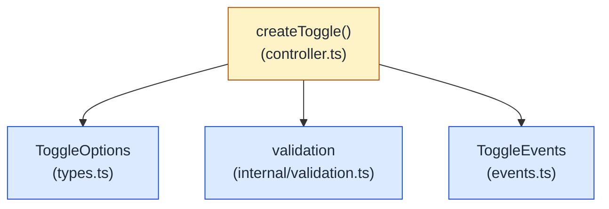

# @ailuracode/alpine-toggle

Framework-agnostic state machine for Alpine.js. Two required opposite states (`on`, `off`) and an optional independent state (`indeterminate`). Returns a reactive, evented, lifecycle-aware controller per call — no DOM, no storage, no system observers. Built on `@ailuracode/alpine-core`'s `BaseController`.

## Architecture



The core is engine-free: no Alpine import, no DOM mutation, no `window`/`document`/`localStorage` access at any time. The Alpine integration is a thin adapter that wires the controller into `$toggle` magic.

## State model

Two cases, one shape:

| Field                    | Meaning                                                              | Required                                  |
| ------------------------ | -------------------------------------------------------------------- | ----------------------------------------- |
| `states.on`              | The first opposite state                                             | **yes** — binary case                     |
| `states.off`             | The second opposite state                                            | **yes** — binary case                     |
| `states.indeterminate`   | An independent third state (skipped by `toggle()`, walked by `next()`) | no — opt-in, only when genuinely needed   |
| `initial`                | Starting value                                                       | optional — defaults to `on`               |

**The binary case is the default.** Most consumers only need `on` and `off`; that is what `toggle()`, `set()`, and `next()` cover. Add `indeterminate` only when the third value is genuinely outside the on/off opposition (tri-state checkboxes, `'loading'` placeholders, `'unknown'` answers).

`toggle()` flips between `on` and `off`. From `indeterminate` it moves to `on` — never the other way around. `next()` advances through every configured state in declaration order (`on` → `off` → `indeterminate` → `on`).

## Install

```bash
pnpm add @ailuracode/alpine-toggle @ailuracode/alpine-core alpinejs
```

## Standalone usage (no Alpine)

```ts
import { createToggle } from "@ailuracode/alpine-toggle";

const power = createToggle({ states: { on: "on", off: "off" } });
power.toggle();
power.reset();

power.on("change", (detail) => {
  // detail: { current, previous, source: 'user' | 'reset' | 'initialization' }
  console.log(detail.current, detail.previous, detail.source);
});
```

## Alpine usage

```ts
import Alpine from "alpinejs";
import { togglePlugin } from "@ailuracode/alpine-toggle";

Alpine.plugin(togglePlugin());
Alpine.start();
```

```html
<div x-data="{ power: $toggle({ states: { on: 'on', off: 'off' } }) }">
  <p>Power: <strong x-text="power.value"></strong></p>
  <button type="button" @click="power.toggle()">Toggle</button>
  <button type="button" @click="power.reset()">Reset</button>
</div>
```

Each `$toggle(options)` call returns an independent reactive instance backed by a fresh `ToggleController`. Mutations flow through `Alpine.reactive`, so templates re-render on every change.

### Ternary — when you genuinely need a third state

```html
<div x-data="{ answer: $toggle({
  states: { on: 'yes', off: 'no', indeterminate: 'unknown' },
  initial: 'unknown',
}) }">
  <p>Answer: <strong x-text="answer.value"></strong></p>
  <button type="button" @click="answer.toggle()">Yes / No</button>
  <button type="button" @click="answer.next()">Cycle</button>
  <button type="button" @click="answer.set(answer.indeterminate)">Reset to unknown</button>
</div>
```

`toggle()` skips `indeterminate` — from `'unknown'` it jumps to `'yes'`. Use `next()` to walk through all three.

## Cleanup

`controller.destroy()` is idempotent and tears down every event listener. The plugin forwards destroy through `Alpine.cleanup` when available, so every controller created by `$toggle(...)` is destroyed when Alpine tears down the runtime.

```ts
const toggle = createToggle({ states: { on: 1, off: 0 } });
const unsubscribe = toggle.on("change", (detail) => { /* ... */ });

unsubscribe(); // stop one listener
toggle.destroy(); // stop every listener — idempotent
```

## TypeScript

```ts
import { createToggle, type ToggleInstance } from "@ailuracode/alpine-toggle";

const binary = createToggle({ states: { on: "on", off: "off" } });
binary.states.indeterminate; // undefined
binary.value; // "on" | "off"

const ternary = createToggle({
  states: { on: "yes", off: "no", indeterminate: "unknown" },
});

const instance: ToggleInstance<"yes", "no", "unknown", "yes" | "no" | "unknown"> = ternary;
```

Add `/// <reference path="node_modules/@ailuracode/alpine-toggle/dist/global.d.ts" />` for `$toggle` in templates.

## API reference

```ts
const toggle = createToggle({
  states: { on: T, off: T, indeterminate?: T },
  initial?: T,
  id?: string,
});

toggle.value          // current state
toggle.states         // { on, off, indeterminate }
toggle.on             // shorthand for states.on
toggle.off            // shorthand for states.off
toggle.indeterminate  // shorthand for states.indeterminate (undefined for binary)
toggle.is(value)      // boolean — strict equality against the current value
toggle.set(value)     // void — silently no-ops on invalid / unchanged input
toggle.toggle()       // flips on ↔ off; from indeterminate → on
toggle.next()         // advances through [on, off, indeterminate]
toggle.reset()        // restores initial
toggle.on('change', listener) // listener({ current, previous, source })
toggle.destroy()      // idempotent, releases listeners
```

```ts
Alpine.plugin(togglePlugin({ id?: string }));
```

## SSR

The package is fully importable in a Node runtime. The controller never touches `window`, `document`, or `localStorage`; the Alpine integration only runs when `Alpine.plugin(...)` is called, which the consumer controls.

## Migration from `@ailuracode/alpine-toggle@0.1.x`

`0.2.0` is a breaking rewrite. The public surface changed:

| `0.1.x`                                                          | `0.2.x`                                                                                            |
| ---------------------------------------------------------------- | -------------------------------------------------------------------------------------------------- |
| `states.truly` / `states.falsely` / `states.ternary`             | `states.on` / `states.off` / `states.indeterminate`                                                |
| `createToggle(options)` returns a plain object                   | `createToggle(options)` returns a `ToggleController extends BaseController<ToggleEvents>`         |
| `cycle()`                                                        | `next()` (semantics unchanged — advance through every state in declaration order)                  |
| `set(value)` returns `boolean`                                   | `set(value)` returns `void`; subscribe to `on('change', ...)` for transition notifications        |
| No events                                                        | `change` event with `{ current, previous, source }` detail payload                                 |
| `default export togglePlugin(Alpine) => void`                    | Named `togglePlugin(options?) => Alpine.PluginCallback` factory (matches `themePlugin` shape)      |
| `createToggleMagic()` helper                                     | Removed — the plugin inlines the factory; standalone consumers use `createToggle(...)`             |
| Constructor is plain                                             | Extends `BaseController` — `id`, `phase`, `isMounted`, `isDestroyed`, `mount()`, `destroy()` exposed |

The default export is gone — use `import { togglePlugin } from "@ailuracode/alpine-toggle"`. This matches the rest of the toolkit (`themePlugin`, `themeController`, etc.).

## License

MIT