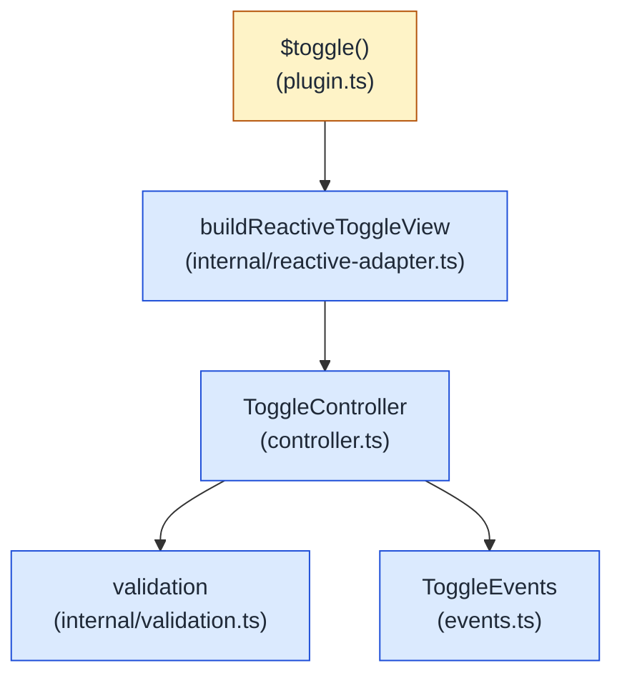

# @ailuracode/alpine-toggle

Framework-agnostic state machine for Alpine.js. Two required opposite states (`on`, `off`) and an optional independent state (`indeterminate`). Returns a reactive, evented, lifecycle-aware controller per call — no DOM, no storage, no system observers. Built on `@ailuracode/alpine-core`'s `EventEmitter`.

## Tiers

Choose the smallest entrypoint that provides the capabilities you need. All tiers share the `{ value, set, toggle }` contract.

| Tier | Import | API | Gzip | Brotli | Recommended for |
| --- | --- | --- | ---: | ---: | --- |
| Puppy | `@ailuracode/alpine-toggle/puppy` | Binary `value`, `set`, `toggle` | 345 B | 311 B | Trivial binary toggles |
| Doggo | `@ailuracode/alpine-toggle/doggo` | Puppy + custom/ternary states, `is`, `next`, `reset`, `onChange` | 700 B | 643 B | Ternary state and lightweight subscriptions |
| Big Dog | `@ailuracode/alpine-toggle` | Doggo + ids, lifecycle, typed events, `setSilently` | 1,082 B | 959 B | Full controller and hydration needs |

Each entrypoint is built independently. Importing Puppy or Doggo does not include Big Dog's event emitter, controller lifecycle, or id generation.

## Architecture



The core is engine-free: no Alpine import, no DOM mutation, no `window`/`document`/`localStorage` access at any time. The Alpine integration is a thin adapter that wires the controller into the `$toggle` magic.

### Reactivity wiring

`ToggleController` stores state in JS private fields (`#value`, `#hasTernary`, `#destroyed`, `#mounted`) — storage locations Alpine's reactive `Proxy` cannot intercept. To make the Alpine-facing instance truly reactive, the plugin builds a small **mutable facade** between the controller and `Alpine.reactive`:

1. `buildReactiveToggleView(controller)` constructs a plain object whose commands (`set`, `toggle`, `next`, `reset`) delegate to the controller. `setSilently` (hydration path) writes the new value directly because it does not emit a `change` event.
2. `Alpine.reactive(view)` wraps the facade. Every command goes through the controller; the controller emits a typed `change` event synchronously.
3. The plugin's bridge subscription — closing over the **reactive proxy**, not the raw facade — writes `reactive.value = detail.current` once per transition. The write fires Alpine's `set` trap, so every `x-text` / `x-bind` / `x-show` binding re-renders.

Each transition fires exactly one `set` trap. The facade's lifecycle flags (`isMounted`, `isDestroyed`, `id`) are getters that delegate to the controller so they always reflect current state.

## State model

Two cases, one shape:

| Field                    | Meaning                                                              | Required                                  |
| ------------------------ | -------------------------------------------------------------------- | ----------------------------------------- |
| `states.on`              | The first opposite state                                             | **yes** — binary case                     |
| `states.off`             | The second opposite state                                            | **yes** — binary case                     |
| `states.indeterminate`   | An independent third state (skipped by `toggle()`, walked by `next()`) | no — opt-in, only when genuinely needed   |
| `initial`                | Starting value                                                       | optional — defaults to `on` (binary) or `indeterminate` (ternary) |
| `id`                     | Stable identifier exposed through `controller.id`                    | optional — auto-generated as `toggle-<n>` |

**The binary case is the default.** Most consumers only need `on` and `off`; that is what `toggle()`, `set()`, and `next()` cover. Add `indeterminate` only when the third value is genuinely outside the on/off opposition (tri-state checkboxes, `'loading'` placeholders, `'unknown'` answers).

`toggle()` flips between `on` and `off`. From `indeterminate` it moves to `on` — never the other way around. `next()` advances through every configured state in declaration order (`on` → `off` → `indeterminate` → `on`).

## Install

```bash
pnpm add @ailuracode/alpine-toggle @ailuracode/alpine-core alpinejs
```

## Standalone usage (no Alpine)

```ts
import { createToggle } from "@ailuracode/alpine-toggle";

const power = createToggle({ states: { on: "on", off: "off" } });
power.toggle();
power.reset();

power.on("change", (detail) => {
  // detail: { current, previous, source: 'user' | 'reset' | 'initialization' }
  console.log(detail.current, detail.previous, detail.source);
});
```

`createToggle()` returns an initialized `ToggleController` — `mount()` runs internally so the `change` listener above receives the `initialization` event on the next microtask. Use this in non-Alpine contexts (tests, vanilla TS widgets, server-side rendering).

## Alpine usage

```ts
import Alpine from "alpinejs";
import { togglePlugin } from "@ailuracode/alpine-toggle";

Alpine.plugin(togglePlugin());
Alpine.start();
```

```html
<div x-data="{ power: $toggle({ states: { on: 'on', off: 'off' } }) }">
  <p>Power: <strong x-text="power.value"></strong></p>
  <button type="button" @click="power.toggle()">Toggle</button>
  <button type="button" @click="power.reset()">Reset</button>
</div>
```

Each `$toggle(options)` call returns an independent reactive facade backed by a fresh `ToggleController`. Mutations flow through `Alpine.reactive`, so templates re-render on every change — `x-text` and `x-bind` track `power.value` automatically.

### Ternary — when you genuinely need a third state

```html
<div x-data="{ answer: $toggle({
  states: { on: 'yes', off: 'no', indeterminate: 'unknown' },
  initial: 'unknown',
}) }">
  <p>Answer: <strong x-text="answer.value"></strong></p>
  <button type="button" @click="answer.toggle()">Yes / No</button>
  <button type="button" @click="answer.next()">Cycle</button>
  <button type="button" @click="answer.set(answer.states.indeterminate)">Reset to unknown</button>
</div>
```

`toggle()` skips `indeterminate` — from `'unknown'` it jumps to `'yes'`. Use `next()` to walk through all three.

### Hydration via `setSilently`

`setSilently(value)` writes the value without emitting a `change` event. The Alpine facade still re-renders because the facade method updates its `value` property directly. Pair it with `x-init` to seed the controller from `localStorage` or server-provided state without producing a spurious `'user'` event:

```html
<div
  x-data="{
    persisted: JSON.parse(localStorage.getItem('mode') ?? 'null'),
    mode: $toggle({ states: { on: 'on', off: 'off' }, initial: 'on' }),
    init() { if (this.persisted) this.mode.setSilently(this.persisted); },
  }"
>
  <span x-text="mode.value"></span>
  <button type="button" @click="mode.toggle(); localStorage.setItem('mode', JSON.stringify(mode.value))">
    Toggle
  </button>
</div>
```

## Cleanup

`controller.destroy()` is idempotent and tears down every event listener. The plugin forwards destroy through `Alpine.cleanup` when available, so every controller created by `$toggle(...)` is destroyed when Alpine tears down the runtime.

```ts
const toggle = createToggle({ states: { on: 1, off: 0 } });
const unsubscribe = toggle.on("change", (detail) => { /* ... */ });

unsubscribe(); // stop one listener
toggle.destroy(); // stop every listener — idempotent
```

The Alpine facade exposes `isDestroyed` so consumers can guard templates:

```html
<template x-if="!power.isDestroyed">
  <span x-text="power.value"></span>
</template>
```

## TypeScript

```ts
import { createToggle, type ToggleInstance, type ToggleReactiveView } from "@ailuracode/alpine-toggle";

const binary = createToggle({ states: { on: "on", off: "off" } });
binary.states.indeterminate; // undefined
binary.value; // "on" | "off"

const ternary = createToggle({
  states: { on: "yes", off: "no", indeterminate: "unknown" },
});

const instance: ToggleInstance<"yes", "no", "unknown", "yes" | "no" | "unknown"> = ternary;

// The Alpine facade is a `ToggleReactiveView` — assignable to
// `ToggleInstance` for backward compatibility, plus lifecycle flags.
const view: ToggleReactiveView<"on", "off"> = $toggle({ states: { on: "on", off: "off" } });
view.id;          // string
view.isMounted;   // boolean
view.isDestroyed; // boolean
```

Add `/// <reference path="node_modules/@ailuracode/alpine-toggle/dist/global.d.ts" />` for ambient type access in templates.

## API reference

```ts
// Standalone factory — returns the mounted ToggleController.
const toggle = createToggle({
  states: { on: T, off: T, indeterminate?: T },
  initial?: T,
  id?: string,
});

toggle.value          // current state
toggle.id             // auto-generated stable id (toggle-<n>)
toggle.states         // { on, off, indeterminate }
toggle.is(value)      // boolean — strict equality against the current value
toggle.set(value)     // void — silently no-ops on invalid / unchanged input
toggle.setSilently(value) // void — sets without emitting (use for hydration)
toggle.toggle()       // flips on ↔ off; from indeterminate → on
toggle.next()         // advances through [on, off, indeterminate]
toggle.reset()        // restores initial
toggle.on('change', listener) // listener({ current, previous, source })
toggle.once('change', listener) // fires once, then auto-unsubscribes
toggle.off('change', listener) // detach a single listener
toggle.removeAllListeners()    // detach every listener
toggle.destroy()      // idempotent, releases listeners
toggle.isMounted      // true after mount() ran
toggle.isDestroyed    // true after destroy() ran

// Alpine magic — returns the reactive facade backed by a fresh controller.
const view = $toggle({ states: { on, off, indeterminate?: N }, initial?: ..., id?: string });

view.value          // current state — narrow union (binary drops undefined)
view.states         // { on, off, indeterminate }
view.is(value)      // boolean
view.set(value)     // void
view.setSilently(value) // void — facade writes through to Alpine so templates re-render
view.toggle()       // flips on ↔ off
view.next()         // advances through states
view.reset()        // restores initial
view.id             // controller id (auto-generated)
view.isMounted      // true once mount() has been called
view.isDestroyed    // true once the controller has been destroyed
```

```ts
Alpine.plugin(togglePlugin({ id?: string }));
```

`setSilently(value)` is the hydration escape hatch — set the value without broadcasting a transition. Pair it with the queued initialization microtask to seed the controller from an authoritative source (`localStorage`, server-provided state) without producing a spurious `'user'` event:

```ts
const persisted = readPersisted();
const toggle = createToggle({ states: { on, off, indeterminate } });
toggle.setSilently(persisted); // preserved through the init microtask
toggle.on("change", (detail) => persist(detail.current));
```

## SSR

The package is fully importable in a Node runtime. The controller never touches `window`, `document`, or `localStorage`; the Alpine integration only runs when `Alpine.plugin(...)` is called, which the consumer controls.

## Migration from `@ailuracode/alpine-toggle@0.1.x`

`1.0.0` is a breaking rewrite. Every entry below landed in the same major release — there were no intermediate `0.2.x` / `0.3.0` / `1.1.x` cuts:

| `0.1.x`                                                          | `1.0.0`                                                                                            |
| ---------------------------------------------------------------- | -------------------------------------------------------------------------------------------------- |
| `states.truly` / `states.falsely` / `states.ternary`             | `states.on` / `states.off` / `states.indeterminate`                                                |
| `createToggle(options)` returns a plain object                   | `createToggle(options)` returns a `ToggleController` (composes `EventEmitter` from `@ailuracode/alpine-core`) |
| `cycle()`                                                        | `next()` (semantics unchanged — advance through every state in declaration order)                  |
| `set(value)` returns `boolean`                                   | `set(value)` returns `void`; subscribe to `on('change', ...)` for transition notifications        |
| No events                                                        | `change` event with `{ current, previous, source }` detail payload                                 |
| `default export togglePlugin(Alpine) => void`                    | Named `togglePlugin(options?) => Alpine.PluginCallback` factory (matches `themePlugin` shape)      |
| `createToggleMagic()` helper                                     | Removed — the plugin inlines the magic factory; standalone consumers use `createToggle(...)`      |
| No hydration API                                                 | `setSilently(value)` sets without emitting; the queued init microtask preserves any hydrated value |
| Controller constructor schedules the init microtask              | Constructor is pure; `mount()` (called internally by `createToggle` / `$toggle`) owns the init microtask |
| `Alpine.reactive(controller)` — invisible to Alpine's `Proxy`     | Mutable facade (`buildReactiveToggleView`) wrapped in `Alpine.reactive` — every transition fires Alpine's `set` trap |
| `id` not exposed on the facade                                   | `ToggleReactiveView` exposes `id`, `isMounted`, `isDestroyed`, and `setSilently`; `Writable<T>` helper exported |
| `phase` lifecycle field on the controller                        | Removed — only `isMounted` / `isDestroyed` remain                                                  |

Prefer the named `togglePlugin` factory — `import { togglePlugin } from "@ailuracode/alpine-toggle"`. The default re-export is retained for compatibility and matches the rest of the toolkit (`themePlugin`, `scrollPlugin`, etc.).

## License

MIT
